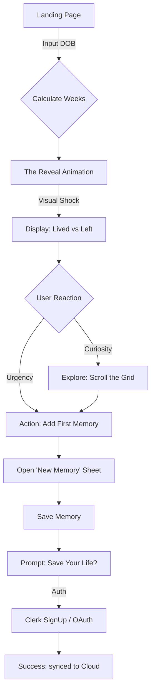
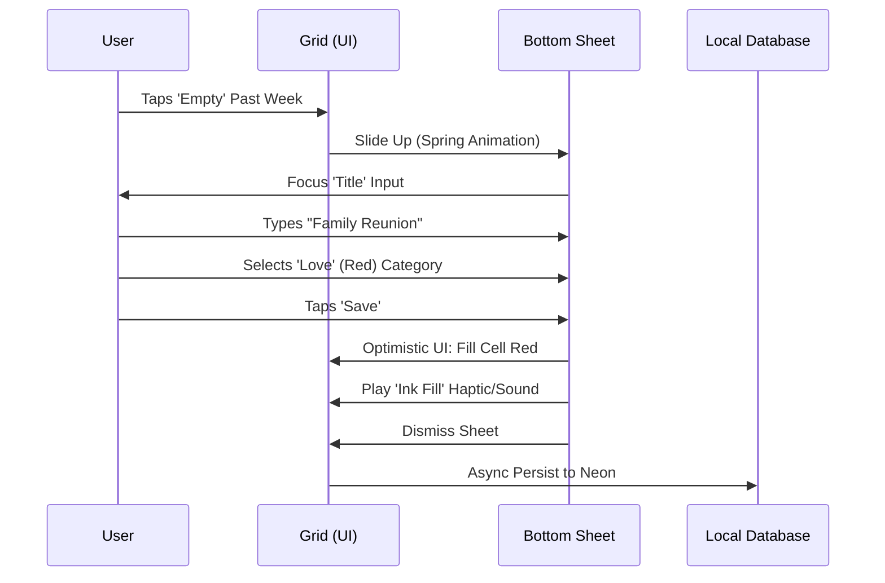

# UX Design Specification - Life Calendar

**Author:** Choudat
**Date:** 2026-01-07

---

## Executive Summary

### Project Vision
Life Calendar is a "Memento Mori" visualization tool that helps users grasp the finiteness of their lifespan. The UX goal is to shift the user's mindset from "productivity/optimization" to "perspective/meaning." The interface must be minimal, solemn yet hopeful, and uncompromisingly high-performance.

### Target Users
**The Introspective Planner.**
Users who feel the acceleration of time (often triggered by life events like parenthood or turning 30/40). They are looking for a visual anchor to ground their memories and future plans. They value privacy, data ownership, and clean aesthetics.

### Key Design Challenges
*   **The Mobile "Grid":** Displaying ~4,600 interactive touch targets on a 360px wide screen without breaking usability.
*   **Frictionless Onboarding:** Persuading a user to enter deeply personal data (DOB, Life Expectancy) before they have established trust with the platform.
*   **Offline/Sync States:** Communicating connection status and sync integrity without cluttering the minimalist UI.
*   **Growth & Discovery:** Designing a compelling, SEO-optimized Landing Page that communicates the abstract value of "Time Scarcity" effectively to cold traffic.

### Design Opportunities
*   **Narrative Onboarding:** Turning the setup process (DOB input) into a storytelling moment ("You have lived X weeks...").
*   **Tactile "Filling":** Making the act of marking a week "done" or adding an event feel physically satisfying (haptics/micro-interactions).
*   **The "Hook" Landing Page:** Creating a high-conversion entry point that allows visitors to "Try the Math" (simple DOB input -> Weeks Passed calculation) immediately, acting as a teaser for the full app.

## Core User Experience

### Defining Experience
**"Marking Time"**
The core loop is the act of turning an abstract "week cell" into a concrete "memory." This transforms the grid from a terrifying countdown (Time Left) into a cherished archive (Life Lived).

### Platform Strategy
**Mobile-First PWA**
*   **Primary Context:** Personal, private reflection on a mobile device.
*   **Key Capability:** Offline-first architecture allowing users to add thoughts even without signal (subway/plane).
*   **Desktop:** detailed "Life Review" mode with broader visualization tools.

### Effortless Interactions
1.  **Context-Aware Add:** Tapping a cell implies the date. No date pickers by default.
2.  **Smart Categorization:** Simple, distinct color-coding (Health, Career, Family) that visually pops against the monochrome grid.
3.  **Visual Feedback:** Immediate haptic feedback or subtle animation when a week is "filled."

### Critical Success Moments
1.  **The "Perspective Shift":** The first time the full grid renders (Onboarding), shocking the user with the ratio of "Lived" vs "Left."
2.  **The "Safety" Confirmation:** The subtle "Cloud Checkmark" that assures the user their life memories are persisted forever.

### Experience Principles
*   **Solemnity over Flash:** Animations are slow, deliberate, and respectful, not bouncy or "gamified."
*   **Respect the Input:** User data is the most high-contrast element on the screen. The UI recedes; the Memories advance.
*   **Fearless Transparency:** We do not hide the end of the grid. The finiteness is the feature.

## Desired Emotional Response

### Primary Emotional Goals
**"Positive Urgency" & "Serene Acceptance"**
The product must thread the needle between existential dread and motivating clarity. The user should leave the app feeling *more present* in their real life, not anxious about their future death.

### Emotional Journey Mapping
1.  **The Hook (Acquisition):** *Curiosity.* "Is my life really that short?"
2.  **The Reveal (Onboarding):** *Vulnerability.* The "Aha" moment of seeing the grid is emotionally heavy. The UI counters this with instant agency ("Add your first memory").
3.  **The Habit (Retention):** *Stewardship.* The user becomes the curator of their own life museum. The feeling shifts from "counting down" to "filling up."

### Micro-Emotions
*   **Trust:** In the privacy and permanence of the data.
*   **Relief:** That a memory is safely stored and won't be forgotten.
*   **Gravity:** A sense that this data matters more than a tweet or Instagram post.

### Design Implications
*   **Color Strategy:**
    *   **Past:** High saturation/Opacity (Concrete, Real).
    *   **Future:** Low opacity/Outline (Open, Unwritten).
    *   **Background:** Stark white or deep black (No distractions).
*   **Interaction Speed:**
    *   **Navigation:** Instant/Snappy (High performance).
    *   **Data Revelation:** Slow/Faded (Ceremonial).

### Emotional Design Principles
*   **The UI is the Frame, Life is the Art:** Minimal chrome. No gamification badges. No "streaks."
*   **Don't Sh*tcoat Reality:** We don't hide the "End Date." We present it simply and elegantly.
*   **Quiet by Default:** No notifications unless requested. The app waits for you.

## UX Pattern Analysis & Inspiration

### Inspiring Products Analysis
1.  **GitHub (Contribution Graph):** Proves that abstract squares can carry immense emotional weight. We evolve this from "Productivity" (Green opacity) to "Life Resonance" (Semantic color).
2.  **Stoic. (Journaling):** Demonstrates that "Negative Visualization" (memento mori) can be a premium experience.
3.  **Linear (Issue Tracker):** The gold standard for "Instant Performance." We adopt its Optimistic UI and Keyboard-first philosophy.

### Transferable UX Patterns
*   **Semantic Heatmap:** Using color families to denote the "flavor" of a week (Joy, Grief, Growth) rather than just activity volume.
*   **The "Sunday Ritual":** A non-streak-based recurring trigger for weekly reflection.
*   **Virtual Scroll:** Utilizing windowing to keep the 4,000-week DOM lightweight and performant on mobile.

### Anti-Patterns to Avoid
*   **Gamification (Badges/Streaks):** Missing a week is life, not failure. We track *existence*, not *performance*.
*   **Cluttered Analytics:** Users don't need pie charts of their life. They need to *see* the time.
*   **Infinite Canvas:** The grid must have hard edges. The finiteness is the feature.

### Design Inspiration Strategy
*   **Adopt:** The "Heatmap" structure for the grid.
*   **Adapt:** Gamification loops into "Time Capsule" loops (surfacing past memories to reward current logging).
*   **Avoid:** Social sharing prompts. This is a private reflection tool first.

## Design System Foundation

### 1.1 Design System Choice
**Headless Primitives (Shadcn/Radix) + Custom Tailwind v4 Theme.**
We utilize the robust accessibility of Radix primitives but completely override the default aesthetic to match our "Swiss Humanist" vision.

### Rationale for Selection
*   **Performance:** Zero-runtime CSS (Tailwind) is critical. We strictly forbid JS animations on grid cells to protect the 60fps scroll.
*   **Touch Ergonomics:** Radix `Dialog` primitives can be easily enhanced with `Vaul` to create native-feeling bottom drawers on mobile.
*   **Aesthetic:** The "Zinc-950" palette provides the necessary gravity without the harshness of True Black (`#000`) on OLED screens.

### Implementation Approach
*   **Core UI:** `shadcn/ui` for forms/interactive elements.
*   **The Grid:** Custom CSS Grid implementation with `windowing` virtualization for mobile.
*   **Motion:** `framer-motion` for *container* elements (Modals/Drawers) only. Simple CSS transitions for grid cells.

### Customization Strategy
*   **Typography:** Search for "Serif Display + Geometric Sans Body" pairing (e.g., Lora + Geist).
*   **Shape:** `rounded-sm` (4px). Sharp enough for data density, soft enough for touch.
*   **Mobile-First Dialogs:** All interactions on mobile MUST use Bottom Drawers, not centered modals.

## 2. Core User Experience

### 2.1 Defining Experience
**"The Fill" (Annotation)**
The act of claiming a week. Users browse their past, identify a specific time block, and attach meaning (Title, Category, Note) to it. This turns the grid from a countdown into a biography.

### 2.2 User Mental Model
*   **The Archive:** Users view the grid as a museum of their life. Empty spots are "lost memories"; filled spots are "saved assets."
*   **The Artifact:** The colored square IS the memory. The text inside is just metadata.

### 2.3 Success Criteria
*   **Zero-Friction Entry:** No date pickers. Contextual tapping (tapping Week 24 of 2024) is the date selection.
*   **Visual Reward:** The transition from "Empty/White" to "Filled/Colored" must be satisfying enough to drive the habit.
*   **Readability:** The user must be able to read the memory back instantly by hovering/tapping.

### 2.4 Novel UX Patterns
**The "Life Scroll"**
*   **Pattern:** A continuous, non-paginated vertical scroll representing the entirety of a human lifespan.
*   **Challenge:** Disorientation.
*   **Solution:** Sticky Headers for "Decades" or "Life Stages" (20s, 30s) to anchor the user as they scroll through the void.

### 2.5 Experience Mechanics
1.  **Trigger:** User taps a valid (past) week cell.
2.  **Action:** Grid recedes; Input Sheet enters (Mobile).
3.  **Input:**
    *   **Required:** Title (Max 50 chars).
    *   **Optional:** Category (Color), Description, Date Adjustment.
4.  **Commit:** "Save" button or Enter key.
5.  **Feedback:** Sheet dismisses. Cell animates from `bg-transparent` to `CategoryColor`.

## Visual Design Foundation

### Color System
**Palette: "Archive Stone" (Warm & Timeless)**
*   **Canvas:** `#fafaf9` (Stone-50) - Warm paper feel, avoiding harsh clinical white.
*   **Ink:** `#1c1917` (Stone-900) - Softer than pure black.
*   **Structuring:** `#e7e5e4` (Stone-200) - Used for grid lines.

**Semantic Colors (Accessible Nature Tones):**
*   **Love/Family:** `#b91c1c` (Red-700) - Brick tone.
*   **Growth/Health:** `#115e59` (Teal-800) - Shifted to Teal for better distinction from Red (Color Blind safe).
*   **Career:** `#1e3a8a` (Blue-900) - Deep Ink/Navy.
*   **Highlight:** `#f59e0b` (Amber-500) - Golden highlighter.

### Typography System
**Theme: "The Novelist"**
*   **Headlines (Serif):** `Lora` (Google Fonts). Evokes printed biography.
*   **Body (Sans):** `Geist Sans`. Technical precision for dense UI.
*   **Data (Mono):** `Geist Mono`. Usage: Dates and Grid coordinates.

### Spacing & Layout Foundation
**Density Strategy: "Texture over Whitespace"**
*   **Grid Implementation:** CSS Grid with `gap-px` on a `Stone-200` background. Cells are White/Stone-50. This creates perfect 1px borders without rendering artifacts.
*   **Container Width:**
    *   **Mobile:** Edge-to-edge grid (no margins).
    *   **Desktop:** Max-width 672px (Prose) for the "Book" feel.

### Accessibility Considerations
*   **Color Blindness:** Teal-800 vs Red-700 ensures distinguishable contrast for Deuteranopia/Protanopia.
*   **Contrast:** All semantic text/icons must typically use White text on these dark backgrounds (`bg-red-700 text-white`) to pass WCAG AA.
*   **Grid Interaction:** Tap targets must be virtually expanded (via CSS pseudo-elements) if the visual cell is <44px.

## Design Direction Decision

### Selected Direction
**"The Biographer"**

### Rationale
The user chose "The Biographer" as the defining aesthetic for the application. This direction moves the product away from a cold, academic archive ("The Librarian") or a stark data visualization ("The Essentialist") towards a warmer, narrative-driven experience.

### Key Characteristics
*   **Vibe:** A story being written. It feels like a living document rather than a static record.
*   **Visual Language:**
    *   **Shape:** `rounded-sm` (Rounded Corners) on grid cells to soften the "spreadsheet" feel.
    *   **Styling:** Usage of soft shadows and opacity layers to create depth.
    *   **Typography:** Prominent use of *Italic Serif* (`Lora Italic`) for storytelling elements.
    *   **Whitespace:** More generous whitespace around the narrative elements compared to the grid.

### Refined Visual Rules
*   **Grid Cells:** Will use `rounded-[2px]` or `rounded-sm` with `gap-1` (instead of `gap-px`) to separate the weeks into distinct "beads" or "pebbles" rather than a strict mesh.
*   **Narrative Emphasis:** Headers and Summary cards will prioritize the "Story of the Life" (e.g., "33 Years Lived") over raw data stats.
*   **Interaction:** Hover states will trigger a slight scale-up (`scale-110`) to make the memories feel tactile and responsive.

## User Journey Flows

### 1. The Reveal (Onboarding Flow)
The critical path from "Cold Traffic" to "Registered User." We prioritize the "Aha!" moment (seeing the grid) *before* asking for a password.



### 2. The Fill (Weekly Ritual)
The most frequent interaction. Must be performant (instant open) and satisfying (visual reward).



### 3. Life Review (Browsing)
Navigating the massive dataset on mobile.

```mermaid
graph TD
    A[App Launch] --> B[Auto-Scroll to Today]
    B --> C{User Intent}
    C -->|Look Back| D[Scroll Up]
    C -->|Look Forward| E[Scroll Down]
    
    subgraph Navigation
    D --> D1[Sticky Header: '2020s']
    D --> D2[Sticky Header: '2010s']
    end
    
    D --> F[Tap 'Filled' Cell]
    F --> G[Expand Card (Overlay)]
    G -->|Read| H[View Memory Details]
    G -->|Edit| I[Open Editor]
```

### Journey Patterns
1.  **Contextual Sheet:** Almost all editing happens in a **Bottom Sheet** (Drawer) that overlays the grid, maintaining context. We rarely navigate away from the Grid page.
2.  **Optimistic Color:** The grid updates *instantly* upon save. We do not wait for the server roundtrip to show the color fill.
3.  **Sticky Chapters:** Year/Decade markers act as sticky headers to anchor the long scroll.

### Flow Optimization Principles
*   **No Date Pickers:** Tapping the *visual* week serves as the date selection. Eliminates 3+ taps.
*   **Lazy Auth:** We allow the user to calculate the grid and even "add a memory" (locally) before forcing Signup.
*   **Touch Priority:** The entire bottom 30% of the screen is reserved for interaction triggers (Floating Action Button / Drawer handles).

## Component Strategy

### Design System Components (Shadcn/UI Base)
We will leverage `shadcn/ui` for all "Shell" interactions (forms, navigation, feedback) to ensure accessibility and rapid development.

*   **Core Inputs:** `Input`, `Textarea`, `Select` (for Category), `Button`.
*   **Overlays:** `Sheet`/`Drawer` (Critical for mobile editing), `Dialog` (for alerts), `Toast` (for "Saved" feedback).
*   **Data Display:** `Badge` (for Category tags), `Skeleton` (for loading states).

### Custom Components (The Core Experience)
The heart of Life Calendar requires bespoke engineering. These components cannot be found in standard libraries due to their performance constraints (4,000+ nodes).

#### 1. `LifeGrid` (The Canvas)
**Purpose:** Renders 4,680 weeks efficiently.
**Architecture:**
*   **Virtualization:** Uses `react-window` or CSS `content-visibility: auto` to only render weeks in the viewport.
*   **Layout:** CSS Grid with `grid-cols-[13]` (Mobile) -> `grid-cols-[26]` (Tablet) -> `grid-cols-[52]` (Desktop).
*   **Gap Strategy:** `gap-1` (per "Biographer" spec) to create pebble-like texture.

#### 2. `WeekCell` (The Atom)
**Purpose:** Interactive touch target for a specific week.
**States:**
*   `Future` (Outline/Low Opacity).
*   `Past` (Filled/Gray).
*   `Memory` (Colored/Interactive).
*   **Focus State:** Scale `1.1` + Shadow (No border-color changes to keep "Biographer" softness).

#### 3. `NarrativeHeader`
**Purpose:** Dynamic storytelling text that changes as you scroll.
**Behavior:**
*   Default: "Oct 12, 2024 • Week 1,720".
*   On Scroll: Sticks to top.
*   Context: Updates to show "The 20s", "The 30s" based on the visible grid area.

#### 4. `MemorySheet` (The Editor)
**Purpose:** The write interface.
**Customization:**
*   Extends Shadcn `Sheet`.
*   **Biographer Tweak:** Paper-like background (`bg-stone-50`), Serif typography for the input fields (writing a story, not filling a form).

### Implementation Roadmap

#### Phase 1: The Core (MVP)
*   `LifeGrid` (CSS Grid version, optimized).
*   `WeekCell` (Base variant + variants for Categories).
*   `MemorySheet` (Read/Write functionality).
*   `AuthenticationForm` (Clerk wrapper).

#### Phase 2: The Narrative (V1.1)
*   `StickyHeader` (Scroll spy logic).
*   `virtualizer` (Performance upgrade for older phones).
*   `StatsCard` (Summary blocks: "34% Lived").

### Implementation Strategy
1.  **Tailwind v4 First:** No CSS files. All styling uses utility classes or arbitrary values `w-[23px]` where strictly necessary for grid math.
2.  **Radix Primitives:** We will not build Modals from scratch. We wrap Radix primitives.
3.  **Strict Isolation:** `LifeGrid` logic (date math) is decoupled from `LifeGrid` visual (components).

## UX Consistency Patterns

### Interaction Hierarchy (The Button-less UI)
The app minimizes explicit buttons in favor of direct manipulation.
*   **Primary Action:** Tapping the object itself (The Week Unit).
*   **Secondary Action:** Long-press or Hover (Reveal Meta-data).
*   **Tertiary Action:** Floating Action Button (FAB) or dedicated "Add" button (Only used when context is unclear, e.g., empty state).
*   **Destructive Actions:** require a "Friction Confirm" (e.g., Hold to Delete) rather than a simple tap, mirroring the permanence of life choices.

### Feedback Patterns (The "Ink" Metaphor)
*   **Success (Save):**
    *   **Visual:** The cell fills instantly (`Optimistic UI`).
    *   **Haptic:** A short, sharp "thud" (Heavy Impact) indicating permanence.
    *   **Sound:** A subtle "pen on paper" scratch or "stamp" sound.
    *   **Toast:** *Avoid bubbles.* Use an inline status indicator ("Saved") that fades out.
*   **Error:**
    *   **Visual:** The cell explicitly shakes (horizontal vibration animation).
    *   **Haptic:** Double buzz (Warning).
*   **Loading:**
    *   **Initial Load:** A progressive "sweep" animation filling the grid from birth to present (telling the story of time passing).
    *   **Lazy Load:** Shimmer effect (`Skeleton`) on text blocks. The Grid cells *never* shimmer; they render gray/empty instantly.

### Form Patterns (The "Biographer" Editor)
Forms should feel like diary entries, not tax returns.
*   **Input Styling:**
    *   **Border:** None or Bottom-only (`border-b border-stone-200`).
    *   **Background:** Transparent.
    *   **Typography:** Serif (`Lora`), larger than standard inputs (18px+).
*   **Labeling:** Labels act as prompts (e.g., "What do you remember?" instead of "Title").
*   **Keyboard:** On mobile, the "Go" / "Enter" key on the virtual keyboard should submit the form if the field is single-line.

### Navigation Patterns
*   **The "Anchor" Pattern:** The header always displays the Current Year / Age relative to the scroll position. Tapping the header scrolls to "Today."
*   **Deep Linking:** Every week has a permalink URL schema (`/life/week/1042`). Sharing a link opens the app focused on that specific week.

### Empty State Patterns
*   **The "Future" is not Empty:** Future weeks are not "No Data" states; they are "Unwritten" states.
    *   **Visual:** Dashed outline or low opacity fill.
    *   **Text:** "This week hasn't happened yet. Make it count."
*   **The "Past" Empty State:**
    *   **Visual:** A subtle "ghost" icon (e.g., a faded question mark) indicating a missing memory.
    *   **Prompt:** "What happened here?"

## Responsive Design & Accessibility

### Adaptive Grid Strategy (The 4,000-Node Challenge)
The `LifeGrid` is the primary interface. It does not just "shrink"; it fundamentally re-architects its geometry based on screen width.

1.  **Mobile (Portrait) - The Scroll:**
    *   **Logic:** `grid-cols-[13]`. Each row is a Quarter (Season).
    *   **Ergonomics:** Edge-to-edge. No sidebar. Navigation is via Bottom Sheet.
    *   **Focus:** Verticality. The "Life Scroll" is the dominant metaphor.

2.  **Tablet / Large Mobile (Landscape):**
    *   **Logic:** `grid-cols-[26]`. Each row is a Half-Year.
    *   **Ergonomics:** Sidebar navigation appears on the left (thin strip).

3.  **Desktop:**
    *   **Logic:** `grid-cols-[52]`. Each row is a full Year.
    *   **Ergonomics:** The Grid is centered with maximum width (`max-w-4xl`). The "Life Review" panel appears on the right sidebar, showing stats and selected memory details side-by-side with the grid.

### Breakpoint System (Tailwind v4)
We stick to standard TW breakpoints but with specific overrides for grid math.
*   **Base:** Mobile First (`cols-13`).
*   **md (768px):** Tablet (`cols-26`).
*   **xl (1280px):** Desktop (`cols-52`).

### Accessibility Strategy (WCAG AA Compliance)
The "Biographer" aesthetic carries risks (subtle colors, small text). We explicitly mitigate these:

1.  **Color Blindness Mode:**
    *   **Problem:** Differentiating "Health" (Teal/Green) from "Love" (Red) on small dots.
    *   **Solution:** A user setting that overlays distinct **Shapes** or **Icons** on the grid cells (e.g., Circle vs Square vs Diamond) when zoomed in or focused.

2.  **Touch Targets:**
    *   **Problem:** 52 columns on a small screen = tiny targets.
    *   **Solution:** CSS `::after` pseudo-elements extend the tappable area of a cell to overlap slightly.
    *   **Zoom Interaction:** Long-press on the grid triggers a "Loupe" (magnifying glass) interaction to select precise weeks without fat-finger errors.

3.  **Screen Readers (Semantic Timeline):**
    *   The Grid is NOT just `div` soup. It is an ordered list `<ol>`.
    *   Each cell needs an `aria-label`: "Week 1,023. Age 19. Start of College. Memory: First day of class."
    *   We implement "Skip to present" navigation links.

### Testing Strategy
*   **Performance Stress Test:** Scrolling the grid on a low-end Android device (simulated 4x slowdown) to ensure 60fps.
*   **The "Sunlight" Test:** Testing the "Stone-50" canvas color in direct sunlight (max brightness) to ensure contrast holds up against glare.

<!-- UX design content will be appended sequentially through collaborative workflow steps -->
